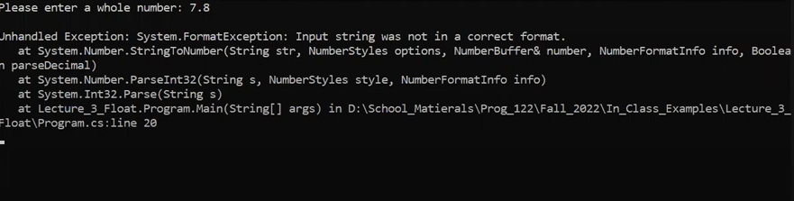

# Guided Assignment and Homework: Try Catch

Lecture: Try Catch (01:06:56 - 01:25:23)

[](https://www.youtube.com/watch?v=rnMKSue9cug&t=4016s)

https://www.youtube.com/watch?v=rnMKSue9cug&t=4016s

## Introduction

A try-catch block is a construct used in programming to gracefully manage unexpected situations or errors that may arise during the execution of a program. It provides a structured way to handle these situations without causing the program to crash abruptly.

In essence, a try-catch block consists of two main components:

1. **Try Block:** This is where you place the code that could potentially encounter issues or errors. Think of it as a protected area where you anticipate problems. If an error occurs within this block, it doesn't disrupt the entire program immediately.
    
2. **Catch Block:** The catch block follows the try block and is responsible for catching and managing exceptions that arise within the try block. Each catch block can specify the type of exception it can handle. When an exception matching the specified type occurs, the corresponding catch block is triggered to handle the situation gracefully.

Example: 

***Prompt the user and a valid input (25)***

```console
Please enter your age: 25
You entered: 25 years old
Program continues after user input.
```

***Without Try-Catch Block and an Improper Input ("cat")***

```console
Please enter your age: cat
Unhandled exception. System.FormatException: Input string was not in a correct format.
   at System.Number.ThrowInvalidFormat(String format, String input)
   at System.Number.ParseInt32(String s, NumberStyles style, NumberFormatInfo info)
   at System.Int32.Parse(String s)
   at Program.Main() in Program.cs:line 12
```

***With Try-Catch Block and an Improper Input ("cat")***
```console
Please enter your age: cat 
Invalid input. Please enter a valid integer age. 
Program continues after user input.
```

--- 

## Click on the link to YouTube to start the Try Catch section of the lecture.

### https://www.youtube.com/watch?v=rnMKSue9cug&t=4016s

[](https://www.youtube.com/watch?v=rnMKSue9cug&t=4016s)

1. **Introduction to Error Handling (1:07:02 - 1:07:33)**
    
    - The importance of error handling is discussed, highlighting issues like game crashes or software errors.
    - Emphasis on being better than game companies that release unfinished games (e.g., Bethesda).
2. **Setting Up a Method for Parsing (1:07:38 - 1:08:15)**
    
    - Instruction on creating a method outside of the main class for parsing a float.
    - Example method named `ParseFloatExample`.
3. **Implementing Try-Catch in Main Method (1:08:28 - 1:09:56)**
    
    - A new try-catch block is implemented in the main method.
    - The process involves prompting the user for a whole number and attempting to parse it, catching format exceptions.
4. **Understanding Variable Scope and Try-Catch (1:09:56 - 1:15:33)**
    
    - Explanation of variable scope: variables are only accessible within their code block or nested blocks.
    - Demonstrating how try-catch can prevent a program from crashing by catching exceptions and allowing the program to continue.
5. **Advanced Usage of Try-Catch (1:15:33 - 1:23:00)**
    
    - Introduction to catching specific exceptions like `FormatException`.
    - Using `Exception ex` in the catch block to get more detailed information about the exception.
    - Discussion of stack traces and their role in pinpointing the source of errors.
6. **Further Discussion on Exceptions and Try-Catch (1:23:00 - 1:25:23)**
    
    - The possibility of catching multiple types of exceptions.
    - Encouragement to use try-catch blocks for error handling in future assignments.

---
## Practice

---
### Step 1 - **Implementing Try-Catch in Main Method**

#### 1. Watch the lecture starting at 01:08:28

```csharp
public static void Main(string[] args) {
	
	// Enter this code
	int number = 0;

	Console.Write("Please enter a whole number: ");
	string userInput = Console.ReadLine();
	number = int.Parse(userInput);
}
```

***Running the Code Without Try-Catch:***

- When you run this code and enter a value that is not a valid integer (like a decimal number or a word), the program will crash.
- This is because `int.Parse(userInput)` throws a `FormatException` when the input is not a valid integer.
- The crash happens because there's no error handling mechanism (like a try-catch block) to catch and handle the exception.

#### 2. Run your code and enter in an invalid `int`, like a decimal number, or word.

- Enter an invalid value, 
	- 4.2 ( Since it's a decimal )
	- cat ( since it is a word )

```console
Please enter a whole number: 7.2 
```


Or




***Observing the Crash:***

- The crash demonstrates the need for proper error handling in scenarios where user input might not be as expected.

---
### Step 2 - **Understanding Variable Scope and Try-Catch (1:09:56 - 1:15:33)**

#### 1. Follow along with the video from 01:09:56 - 1:15:33

```csharp
	int number = 0; // 3. Variable Scope
	
	try
	{
	    // try / catch
	    Console.Write("Please enter a whole number: "); // 1. Adding Try-Catch Block
	    string userInput = Console.ReadLine(); // 1. Adding Try-Catch Block
	    number = int.Parse(userInput); // 1. Adding Try-Catch Block
	} // End of try
	catch
	{
	    Console.WriteLine("The format was invalid"); // 2. Catch Block Handling
	    number = 42; // 2. Catch Block Handling
	}
	
	// try / catch
	
	Console.WriteLine(number); // 2. Catch Block Handling (Continuation of program execution)

```

1. **Adding Try-Catch Block:**
    
    - The `try` block contains the code that might throw an exception (in this case, parsing the user input).
    - If the input is a valid integer, it's parsed and assigned to the `number` variable, and the program continues normally.
    - If the input is not a valid integer, a `FormatException` is thrown, and the control passes to the `catch` block.
2. **Catch Block Handling:**
    
    - The `catch` block is executed in case of an exception.
    - It prints a message ("The format was invalid") and assigns a default value of `42` to the `number` variable.
    - After the catch block, the program continues running, and it prints the value of `number` (which will be `42` if an exception was caught).
3. **Variable Scope:**
    
    - The variable `number` is declared outside the try-catch block, making it accessible both inside and outside the try-catch blocks. This is an important aspect of variable scope.

#### 2. Run your code the first time, and enter the following answer, `4`.

```console
Please enter a whole number: 4
4
```

If you enter a valid value, you program will work like normal

3. Run your code again, and end the following answer, `cat`.

```console
Please enter a whole number: cat
The format was invalid
42
```


---

### Step 3 - **Advanced Usage of Try-Catch (1:15:33 - 1:23:00)**

1. Watch the video starting at 01:15:33.

```csharp
	int number = 0; // 3. Continued Program Execution
	
	try
	{
	    // 1. Catching Specific Exceptions
	    Console.Write("Please enter a whole number: ");
	    string userInput = Console.ReadLine();
	    number = int.Parse(userInput);
	
	} // End of try
	catch(FormatException fex) {
	    // 1. Catching Specific Exceptions
	    Console.WriteLine("This was a format exception");
	    number = 12; // 1. Catching Specific Exceptions
	}
	catch (Exception ex)
	{
	    // 2. Exception Handling Flexibility
	    Console.WriteLine(ex.StackTrace);
	    number = 42; // 2. Exception Handling Flexibility
	}
	
	// try / catch
	
	Console.WriteLine(number); // 3. Continued Program Execution
```

1. **Catching Specific Exceptions:**
    
    - The code now includes two catch blocks: one for `FormatException` and another for a general `Exception`.
    - If a `FormatException` occurs (e.g., when the input is not a valid integer), the first catch block is executed, printing a specific message and assigning `12` to `number`.
    - For any other types of exceptions, the second catch block is executed, printing the stack trace of the exception and assigning `42` to `number`.
2. **Exception Handling Flexibility:**
    
    - This approach provides more flexibility in handling different kinds of exceptions differently.
    - It also demonstrates the concept of catching more specific exceptions first, followed by a more general exception, allowing for tailored responses to different error conditions.
3. **Continued Program Execution:**
    
    - Regardless of which catch block is executed, the program continues to run, and the value of `number` is printed at the end.

---

## Assignment 

Certainly! Here's an example of a console assignment that tests your knowledge of try-catch in C#:

---

## Console Assignment: Error Handling in C\#

**Objective:** Create a C# console application that demonstrates error handling using try-catch blocks.

**Requirements:**

1. Create a C# console application, give it a name of *GA_TryCatch_YourName*
2. Add your name as a comment at the top of the program.
3. Program runs without compile errors
	
3. Implement a program that asks the user to enter their age.

4. Use a try-catch block to handle potential exceptions related to age input.

5. If the user enters a valid integer representing their age, print a message welcoming them with their age. For example: "Welcome! You are [age] years old."

6. If the user enters a non-integer value (e.g., a word or a decimal number), catch the exception and display an error message, such as: "Invalid input. Please enter a valid integer age."

7. If any other exception occurs, catch it and display a generic error message like: "An unexpected error occurred."

8. Ensure that the program continues to execute regardless of whether an exception is caught.

9. Use separate catch blocks for specific exception types and a final catch block for a generic exception.

**Sample Output:**

```
Please enter your age: 25
Welcome! You are 25 years old.
```

```
Please enter your age: cat
Invalid input. Please enter a valid integer age.
```

```
Please enter your age: 25.5
Invalid input. Please enter a valid integer age.
```

```
Please enter your age: abc
An unexpected error occurred.
```

**Hints:**

- Use `int.TryParse()` or `int.Parse()` to handle age input and catch `FormatException` when necessary.
- Organize your code into a try-catch structure as demonstrated in the previous examples.
- Make sure to handle different types of exceptions appropriately.

---

## Rubric

Certainly, here's a rubric for the assignment with a breakdown of points for each requirement:

| Requirement                                | Description                                               | Points |
|--------------------------------------------|-----------------------------------------------------------|--------|
| Program Name and Comment                   | Program is named "GA_TryCatch_YourName" and includes your name as a comment at the top of the program. | 10     |
| Must Run Without Compile Errors            | The program compiles and runs without any compile-time errors. | 30     |
| Age Input and Try-Catch Handling           | The program asks the user to enter their age and uses a try-catch block to handle potential exceptions related to age input. | 20     |
| Valid Age Input                            | If the user enters a valid integer representing their age, the program prints a welcoming message with the user's age. | 10     |
| Non-Integer Input Handling                 | If the user enters a non-integer value, the program catches the exception and displays an error message ("Invalid input. Please enter a valid integer age."). | 10     |
| Generic Exception Handling                 | If any other exception occurs, the program catches it and displays a generic error message ("An unexpected error occurred."). | 10     |
| Program Continuation                        | The program continues to execute regardless of whether an exception is caught. | 10     |
| Separate Catch Blocks                      | Separate catch blocks are used for specific exception types (e.g., FormatException) and a final catch block is used for generic exceptions (e.g., Exception). | 10     |

Total Points: 100
